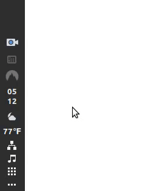

# Linux Cinnamon Desktop Environment Applet for NordVPN

 This repsitory contains a an applet allowing users of the Cinnamon desktop environment on Linux to easily connect and disconnect from a VPN using the NordVPN service. 

 
 # Requirements
 
 Linux with the Cinnamon desktop environment installed and running
 The [NordVPN service](https://nordvpn.com/download/linux/) and an already configured account
  
 # Installation
 
 Copy the content of this git repository to your ``~/.local/share/cinnamon/applets`` folder, then open Cinnamon Settings -> Applets and add the NordVPN item to your panel.
 
 # Usage
 
 Click the NordVPN icon on your panel to toggle the connect or disconnect status. The applet icon will track your connection status and update appropriately.
 

